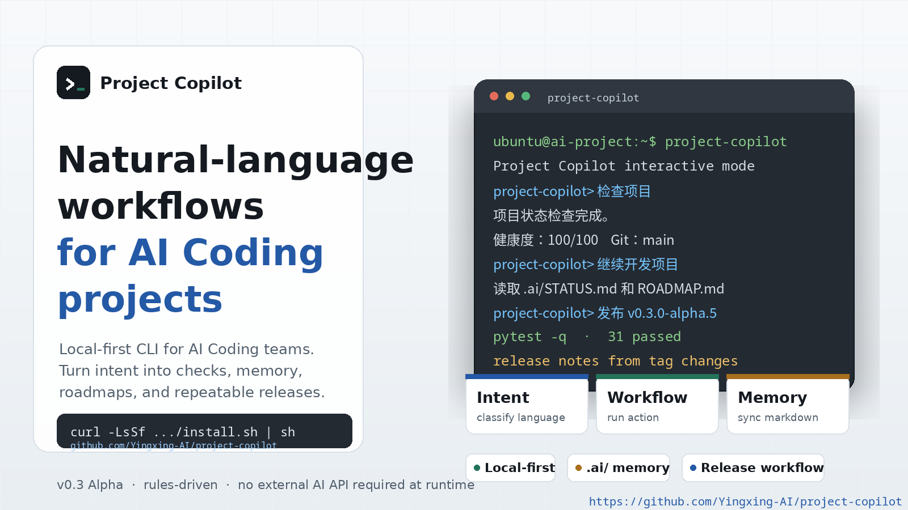
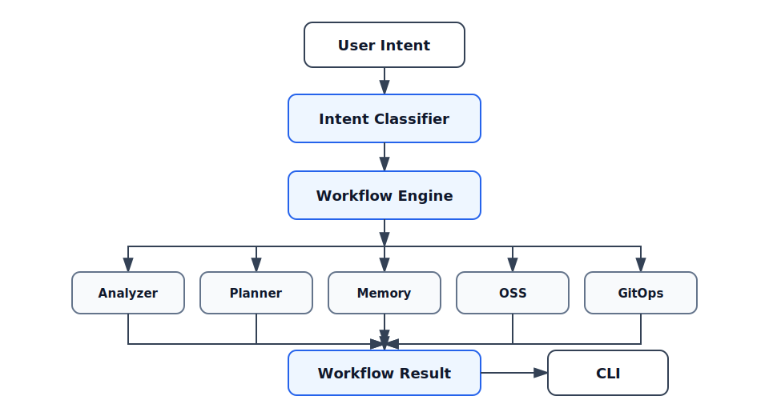

# Project Copilot

Layered project memory for Codex.

Project Copilot installs and maintains a layered project memory set for Codex.

用户只和 Codex 对话。Project Copilot 负责安装和维护 `.ai/` 分层项目记忆规范、生成 `AGENTS.md` 规则，并告诉 Codex 如何区分事实、假设、计划和决策，提醒项目风险和防止项目跑偏。

当前版本是 v0.3.0b2：规则驱动、本地运行、不依赖外部 AI API。

## Beta Notice

Project Copilot is currently a Beta release. It is suitable for trial use, project workflow experiments, and developer feedback. Use it carefully for production or business-critical workflows.

## Available Today

- Codex-native project memory installation
- `AGENTS.md` rules for Codex
- `docs/CODEX_WORKFLOW.md` user guide for working with Codex
- `.ai/` project memory structure
- Existing-project adoption
- New-project initialization
- Local doctor checks
- Natural-language intent recognition
- Workflow engine
- Command mode
- Proposal-driven project onboarding
- Project status card
- Project review
- Project timeline
- Drift check for MVP scope
- Decision recording
- Continue development workflow
- Close day workflow
- OSS readiness check
- OSS preparation workflow
- GitHub sync planning and preflight checks
- One-command GitHub push, tag, and release workflow with dry-run checks
- GitHub Actions CI for Python 3.10, 3.11, and 3.12
- Unknown intent suggestions
- Automatic project state sync for `.ai/STATUS.md`, Roadmap, Changelog, and the managed `AGENTS.md` block
- Pytest coverage for the current workflow surface

## Quick Start

Install with one command:

```bash
curl -LsSf https://raw.githubusercontent.com/Yingxing-AI/project-copilot/main/install.sh | sh
```

This installer is for macOS, Linux, and WSL. Native Windows PowerShell installation will be added later. See [Windows Install Notes](docs/INSTALL_WINDOWS.md).

The installer pins the current beta release tag. You can inspect [install.sh](install.sh) before running it, or install from a local checkout with `pip install -e .`.

Verify the installed CLI:

```bash
project-copilot --help
project-copilot --version
project-copilot doctor
```

For development, install from a local checkout:

```bash
pip install -e .
```

Adopt an existing project:

```bash
project-copilot adopt
```

Or initialize a new project:

```bash
project-copilot init
```

Project Copilot will parse a complete proposal first and only ask follow-up questions when key information is missing.

Project Copilot generates:

- `.ai/`
- `AGENTS.md`
- `docs/CODEX_WORKFLOW.md`

Then work in Codex:

```bash
codex
```

Tell Codex:

```text
继续开发这个项目
```

Codex reads `AGENTS.md` and maintains `.ai/` while it develops.

Check the local setup when needed:

```bash
project-copilot doctor
project-copilot 检查秘书配置
```

Run without installing the console script:

```bash
python3 -m project_copilot.cli.main 检查项目
```

## Demo


Promotional image:



Demo scripts:

- [Adopt Existing Project](docs/demo-script.md#demo-1-adopt-existing-project)
- [New Project Lifecycle](docs/demo-script.md#demo-2-new-project-lifecycle)

## Primary Flow

For a project that already has code:

```bash
project-copilot adopt
codex
```

For a new project:

```bash
project-copilot init
codex
```

Chinese aliases are supported:

```bash
project-copilot 接管已有项目
project-copilot 初始化项目
project-copilot 检查秘书配置
```

## Generated Files

`.ai/` stores the project memory:

- `PROJECT_CONTEXT.md`: stable mission, target users, business goals, MVP scope, tech stack
- `STATUS.md`: current stage, focus, goal, and risks
- `ROADMAP.md`: Backlog, In Progress, Done
- `MEMORY.md`: stable facts, important events, milestones, things not to forget
- `HYPOTHESES.md`: unconfirmed judgments, pending analysis, low-confidence conclusions
- `DECISIONS.md`: product, architecture, technical choices, and tradeoffs
- `WORKLOG.md`: dated work log for completed work only
- `KNOWLEDGE.md`: best practices, references, product learning, community feedback
- `metrics.md`: auxiliary project metrics snapshot, preferably derived from the core memory files
- `history/`: monthly history files such as `YYYY-MM.md`

`AGENTS.md` tells Codex to read and maintain `.ai`.

`docs/CODEX_WORKFLOW.md` explains the user-facing workflow: install project memory with Project Copilot, then work in Codex.

## Validation

Project Copilot 正在真实项目中验证，真实项目可以通过 `.ai/validation.json` 快照接入并自动刷新汇总。初始化、接管、记录决策、结束工作和同步状态时会自动收集当前项目记忆，重点观察 `.ai/` 项目记忆是否能长期保持可读、可维护、可复盘。

可用命令：

- `project-copilot 导出验证快照`
- `project-copilot 刷新验证报告`

- [Validation Report](docs/validation-report.md)
- [Case Studies](docs/case-studies/)
- [Codex for Open Source Readiness](docs/CODEX_FOR_OPEN_SOURCE.md)

## Secondary Commands

These commands remain available for compatibility, but they are not the primary daily entry point:

```bash
project-copilot 项目状态
project-copilot 项目复盘
project-copilot 项目时间轴
project-copilot 项目偏航检查 新增商城模块
project-copilot 记录决策 MVP 先做简历导入
project-copilot 查看路线图
project-copilot 继续开发项目
project-copilot 今天结束工作
project-copilot 检查 OSS 准备度
project-copilot 准备开源
project-copilot 备份到云端
project-copilot 发布版本 v0.3.0-beta.2
project-copilot 发布版本 v0.3.0-beta.2 dry-run
```

Run against another project root:

```bash
project-copilot --root /path/to/project 项目状态
```

## Interactive Mode

Interactive mode is kept for compatibility. It is not the primary daily workflow; prefer `project-copilot adopt` or `project-copilot init`, then use `codex`.

```bash
project-copilot
```

Exit commands:

- `exit`
- `quit`
- `退出`

If an intent cannot be recognized, Project Copilot returns a short list of available suggestions instead of running the wrong workflow.

## Command Mode

Command mode keeps the existing one-shot workflow style:

```bash
project-copilot 项目状态
project-copilot 初始化项目
project-copilot 接管这个已有项目
project-copilot 项目复盘
project-copilot 项目时间轴
project-copilot 项目偏航检查 新增商城模块
project-copilot 记录决策 MVP 先做简历导入
project-copilot 查看路线图
project-copilot 继续开发项目
project-copilot 今天结束工作
project-copilot 备份到云端
```

## Architecture



The CLI does not call workflow modules directly. It sends user text to the workflow engine, which classifies the intent, dispatches to a registered workflow, and renders a `WorkflowResult`.

More details: [docs/ARCHITECTURE.md](docs/ARCHITECTURE.md)

## Project Memory

Project Copilot stores project memory under `.ai/`.

Current memory files:

- `.ai/PROJECT_CONTEXT.md`: 项目使命、目标用户、商业目标、MVP 范围、技术栈
- `.ai/STATUS.md`: 当前阶段、当前重点、当前目标、当前风险
- `.ai/ROADMAP.md`: Backlog、In Progress、Done
- `.ai/MEMORY.md`: 稳定事实、重要事件、关键里程碑、不应遗忘的信息
- `.ai/HYPOTHESES.md`: 未确认判断、待验证分析、低置信度结论
- `.ai/DECISIONS.md`: 产品决策、架构决策、技术选型和取舍原因
- `.ai/WORKLOG.md`: 日期、今日完成、问题、明日计划，仅记录实际完成工作
- `.ai/KNOWLEDGE.md`: 最佳实践、参考项目、产品认知、社区反馈和重要经验
- `.ai/metrics.md`: 辅助指标快照，优先由核心记忆文件派生
- `.ai/history/`: 按月保存的历史归档，例如 `YYYY-MM.md`

The memory system is local Markdown. It is designed to be readable, reviewable, and easy to save with the project.

## Coming Soon

- Better project analysis
- Stronger existing-project adoption reports
- Better secretary reminders
- Softer wording for cloud backup and version publishing
- Optional AI Provider integrations
- Codex Skill packaging
- Codex Plugin packaging

## Development

Run tests:

```bash
pytest -q
```

Current baseline:

```text
63 passed
```

## Contributing

Contributions are welcome. Good first contributions include:

- Better intent examples
- More workflow tests
- Documentation improvements
- Project analysis improvements
- Existing-project adoption improvements

Before opening a pull request, run:

```bash
pytest -q
```

See [CONTRIBUTING.md](CONTRIBUTING.md) and [docs/USAGE.md](docs/USAGE.md).

## License

MIT License. See [LICENSE](LICENSE).
