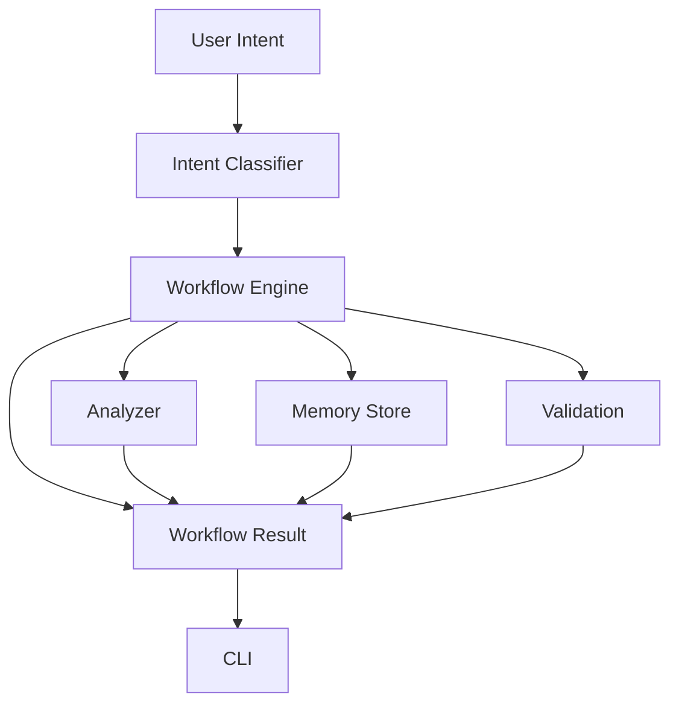

# Architecture

Project Copilot is a local-first project memory layer for Codex. It maps natural-language project-memory intents to deterministic Python workflows and renders concise results for the user.

Current implementation is rule-driven and does not depend on external AI APIs.

## Request Flow

Mermaid source: [architecture.mmd](architecture.mmd)

## Intent To Workflow

Natural-language text enters the intent classifier in `project_copilot/intent/`.

The classifier returns a standard intent name such as:

- `init_project`
- `adopt_project`
- `check_project`
- `continue_development`
- `close_day`
- `review_project`
- `timeline_project`
- `drift_check`
- `record_decision`
- `show_roadmap`
- `export_validation_snapshot`
- `refresh_validation_report`
- `unknown`

The workflow engine in `project_copilot/workflow/engine.py` maps the intent name to a registered memory workflow handler. The CLI only calls the engine; it does not directly call individual workflow files.

## Project Memory

Project memory lives under `.ai/`.

Current files:

- `PROJECT_CHARTER.md`: project mission, target users, MVP scope, non-goals, and boundaries
- `PROJECT_CONTEXT.md`: legacy project context compatibility
- `STATUS.md`: current recovery card
- `ROADMAP.md`: product direction and memory roadmap
- `MEMORY.md`: stable timeline and milestones
- `HYPOTHESES.md`: legacy hypothesis layer
- `DECISIONS.md`: legacy decision index
- `adr/`: ADR files for long-lived decisions and tradeoffs
- `sessions/current.md`: current session candidates
- `sessions/archive/`: confirmed major session summaries
- `WORKLOG.md`: legacy worklog compatibility
- `KNOWLEDGE.md`: long-term practices, product learning, and feedback
- `metrics.md`: auxiliary derived snapshot
- `validation.json`: validation data derived from `.ai`
- `history/`: monthly review archives

The memory system is intentionally Markdown-based so users can review, edit, diff, and commit it.

## Session Memory

The write model is intentionally conservative:

- Start work: read `.ai` and restore context.
- During work: do not automatically expand Roadmap, Memory, or Worklog.
- During work: keep only session candidates.
- End work: confirm what still matters three months from now.
- After confirmation: write accepted items to ADR, Memory, Knowledge, or session archive.

## Module Responsibilities

`project_copilot/cli/`

- Parses command-line arguments.
- Runs compatibility interactive mode.
- Sends text to the workflow engine.

`project_copilot/intent/`

- Classifies natural-language input into standard intent names.
- Uses local keyword rules in the current release line.

`project_copilot/workflow/`

- Registers memory workflow handlers.
- Dispatches intent names to workflow implementations.
- Owns user-facing project-memory workflows.

`project_copilot/memory/`

- Creates and reads the core `.ai/` project memory files.
- Creates ADR and Session Memory directories.

`project_copilot/analyzer/`

- Inspects project files and Git state.
- Produces project health, risks, missing files, and next steps.

`project_copilot/validation/`

- Collects validation snapshots from real `.ai` files.
- Refreshes validation reports from derived data.

`project_copilot/gitops/`

- Inspects local Git status only.
- Does not own commit, push, tag, release, or GitHub sync workflows.

`sync_project_state`

- Refreshes derived validation data only.
- Does not run tests.
- Does not read Git commit/tag state.
- Does not sync README, Roadmap, Changelog, or AGENTS.

## Rule-Driven Beta

The current system is deterministic:

- No external AI API.
- No hosted service.
- No Web UI.
- No hidden remote state.
- No MCP.
- No plugin system.

This keeps the Beta easy to run, test, and reason about.
