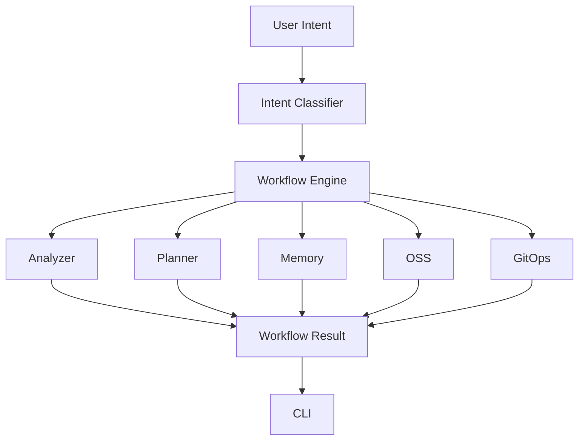

# Architecture

Project Copilot is a local-first workflow CLI and Project Memory Layer installer. It maps natural-language project requests to deterministic Python workflows and renders a concise result for the user.

Current implementation is rule-driven and does not depend on external AI APIs.

## Request Flow

Mermaid source: [architecture.mmd](architecture.mmd)

## Intent To Workflow

Natural-language text enters the intent classifier in `project_copilot/intent/`.

The classifier returns a standard intent name such as:

- `init_project`
- `adopt_project`
- `check_project`
- `continue_development`
- `close_day`
- `oss_check`
- `prepare_oss`
- `github_sync`
- `unknown`

The workflow engine in `project_copilot/workflow/engine.py` maps the intent name to a registered workflow handler. The CLI only calls the engine; it does not directly call individual workflow files.

## WorkflowResult

Workflow handlers return a `WorkflowResult`.

`WorkflowResult` contains:

- `intent_name`: the normalized intent name
- `status`: result status, such as `success` or `needs_input`
- `title`: short user-facing title
- `summary`: concise summary
- `details`: structured key-value details
- `next_steps`: suggested next actions

The result object has a `render()` method that converts the structured result into concise CLI output.

## Project Memory

Project memory lives under `.ai/`.

Current files:

- `PROJECT_CONTEXT.md`: project identity, goals, target users, stack, constraints
- `STATUS.md`: current phase, completed work, active work, next steps
- `ROADMAP.md`: local development roadmap
- `MEMORY.md`: chronological project events
- `DECISIONS.md`: decisions and ADR-style notes
- `HYPOTHESES.md`: unconfirmed judgments and low-confidence conclusions
- `WORKLOG.md`: dated work log for completed work only
- `KNOWLEDGE.md`: best practices, references, product learning, community feedback
- `metrics.md`: auxiliary project metrics snapshot derived from the core memory files
- `history/`: monthly review archives

The memory system is intentionally Markdown-based so users can review, edit, diff, and commit it.

## Module Responsibilities

`project_copilot/cli/`

- Parses command-line arguments.
- Runs command mode or interactive mode.
- Sends text to the workflow engine.

`project_copilot/intent/`

- Classifies natural-language input into standard intent names.
- Uses local keyword rules in the current release line.

`project_copilot/workflow/`

- Registers workflow handlers.
- Dispatches intent names to workflow implementations.
- Owns user-facing project workflows.

`project_copilot/memory/`

- Creates and updates the core `.ai/` project memory files and auxiliary snapshots.

`project_copilot/analyzer/`

- Inspects project files and Git state.
- Produces project health, risks, missing files, and next steps.

`project_copilot/planner/`

- Provides compatibility entry points for workflow execution.

`project_copilot/oss/`

- Checks open-source readiness.

`project_copilot/gitops/`

- Inspects Git status, remotes, and GitHub sync prerequisites.

## Rule-Driven Beta

The current system is deterministic:

- No external AI API.
- No hosted service.
- No Web UI.
- No hidden remote state.

This keeps the Beta easy to run, test, and reason about.

## Future Provider Direction

Future versions may add optional AI Provider support. The intended direction is:

- Keep local deterministic workflows as the default.
- Add providers as optional enhancements, not required dependencies.
- Use providers for summaries, planning, and richer project interpretation.
- Keep workflow execution explicit and reviewable.
